# vrinda-sales-dashboard
Interactive Excel dashboard analysing Vrinda-Store’s 2022 sales data
# Vrinda Sales Annual Report 2022

This Excel dashboard analyzes Vrinda Store’s annual sales performance across channels, states, and demographics.

## Features
- Monthly sales and order trends
- Gender-based sales breakdown
- Order status distribution
- Top 5 states by sales
- Age vs gender order analysis
- Channel performance

## Tools Used
- Excel PivotTables
- Slicers for Month, Channel, Category
- Data cleaning and transformation using Excel functions
- Charts: Pie, Bar, Combo

## Insights
- Maharashtra leads with 2.98M in sales
- Amazon is the top channel (35%)
- Women contribute 64% of total sales

## 📊 Pivot Charts
- Orders vs Sales 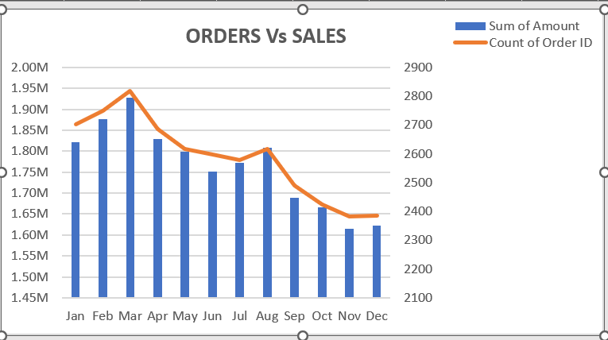
- Gender-Based Sales 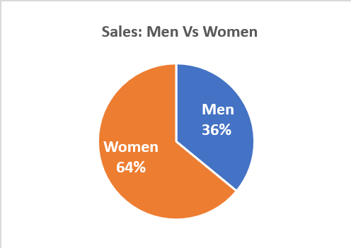
- Order Status 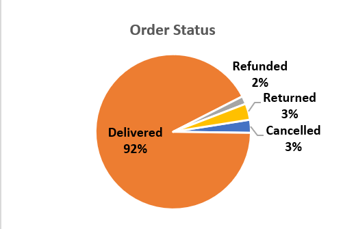
- Sales by State (Top 5) 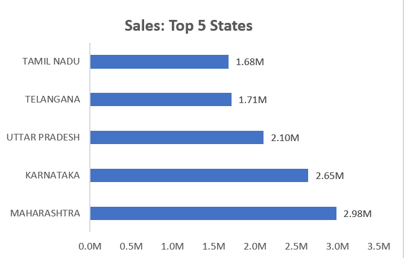
- Age vs Gender 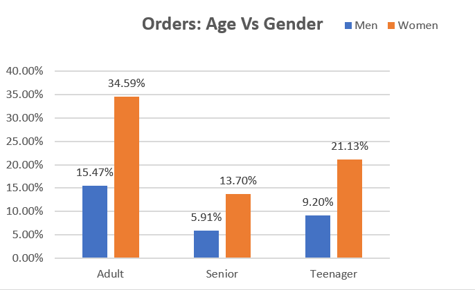
- Channel Distribution 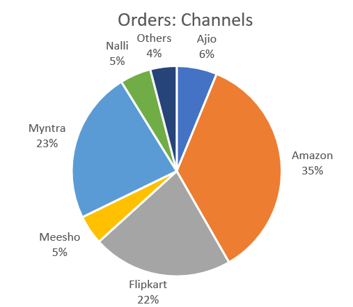

## 📑 Pivot Tables
- Gender Sales 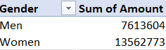
- Order Status 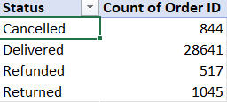
- Sales by State 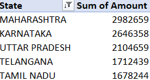
- Age vs Gender 
- Channel Distribution 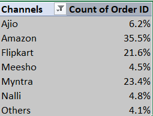

## 🎛️ Slicers 
-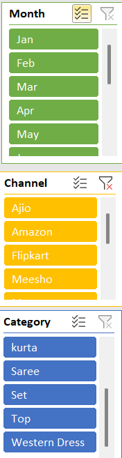

## 🖥️ Dashboard Overview
-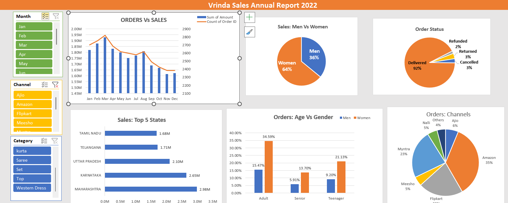

## 📂 Files
- `Vrinda_Store_Data_Analysis.xlsx` → Full dataset + dashboard
- `images/` → All charts, tables, and dashboard screenshots
